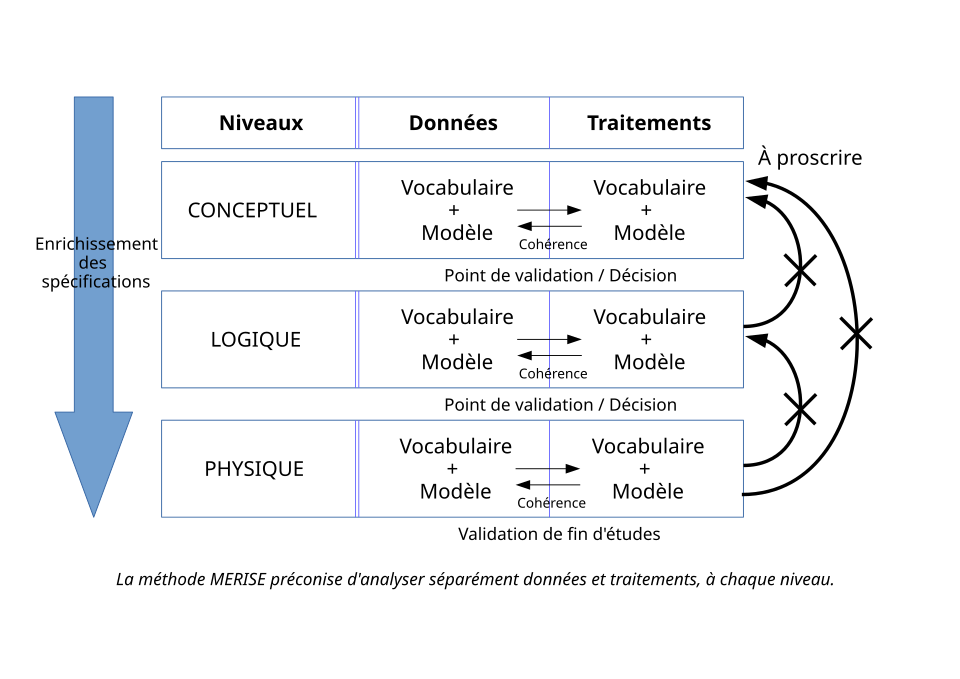

# MERISE

---

## Historique

**MERISE** est une méthode d'analyse, de conception et de gestion de projet informatique qui a été très utilisée dans les années 70 et 80 pour l'informatisation massive des organisations. Elle est adaptée à la gestion de projets internes aux organisations.  
Elle a été inventée aux États-Unis mais a surtout été utilisée en France, par les **SSII** (_actuellement ESN, donc Entreprises de Services du Numérique_).

---

## Définition générale du système (Merise 2)

Dans MERISE 2 (_il y a eu Merise/Objet avant Merise/2_), la définition générale du système comprend les étapes suivantes :

1.  Objectifs de la définition générale du système
2.  Les phases de la définition générale du système
3.  Phase d'appréciation du projet
4.  Positionnement du projet
5.  Délimitation des fonctions à informatiser
6.  Évaluation des enjeux
7.  Phase de spécifications générales
8.  Modélisation conceptuelle des données
9.  Macromodélisation organisationnelle des traitements
10. Rédaction du dossier de spécifications générales.

---

## Position de la méthode

La méthode **Merise** se situait dans le prolongement naturel d'un schéma directeur (_étape majeure pour la définition, la formalisation, la mise en place ou l'actualisation d'un système d'information_), souvent conduit suivant la méthode **RACINES** (_méthode informatique destinée à étudier le système d'information, ayant pour but de définir des priorités d'informatisation_).

Les projets Merise étaient généralement des projets de grande ampleur de refonte d'un existant complexe, dans un environnement **grand système** (_ordinateur central d'une entreprise_).

Cette méthode est exclusivement française. Elle a des équivalents à l'étranger en ce qui concerne les **modèles de données** (_MCD, MLD, MPD_), en revanche la modélisation des traitements est beaucoup plus complexe que dans les méthodes anglo-saxonnes (_UML par exemple, qui détaille moins le MLD_).

Beaucoup de documentation, mais moins d'erreurs lors du code comparé à d'autres méthodes.

---

## Méthode d'analyse et de conception

La méthode d'analyse et de conception propose une démarche articulée simultanément selon 3 axes pour _hiérarchiser_ les préoccupations et les questions auxquelles répondre lors de la conduite d'un projet.

### Cycle de vie

- Phase de conception, de réalisation, de maintenance, puis nouveau cycle de projet.

### Cycle de décision

- Grands choix (GO-NO GO : étude préalable), la définition du projet (étude détaillée), jusqu'aux petites décisions, les détails de la réalisation et de la mise en œuvre du système d'information. Chaque étape est documentée et marquée par une prise de décision.

### Cycle d'abstraction

- Niveaux conceptuel, organisationnel, logique et physique/opérationnel (du plus abstrait au plus concret). L'objectif du _cycle d'abstraction_ est de prendre d'abord les grandes décisions métier, pour les principales activités (conceptuel), sans rentrer dans le détail de questions d'ordre organisationnel ou technique.

---

## Niveau conceptuel

L'étude _conceptuelle_ **Merise** s'attache aux _invariants_ de l'entreprise ou de l'organisme du point de vue métier : quelles sont les activités, les métiers gérés par l'entreprise, quels sont les grands processus traités, de quoi parle-t-on en matière de données, quelles notions manipule-t-on ?... et ce, indépendamment des choix techniques (comment fait-on ?) ou d'organisation (qui fait quoi ?) qui ne seront abordés que dans les niveaux suivants.

**Au niveau conceptuel des données**, on veut décrire, après abstraction, le modèle de l'entreprise ou de l'organisme :

- Le **Modèle conceptuel des données** (**MCD**), schéma représentant la structure du système d'information, du point de vue des données, c'est-à-dire les dépendances ou relations entre les différentes données du système d'information (par exemple : le client, la commande, les produits, etc.)

- Ainsi que le **Modèle conceptuel des traitements** (**MCT**), schéma représentant les traitements, en réponse aux événements à traiter (par exemple : la prise en compte de la commande d'un client).

Dans l'idéal, le **MCD** et le **MCT** d'une entreprise sont stables, ils ne changent pas tant que son activité reste la même.

---

## Notes sur les différents modèles

- [MCD](./notes/mcd.md)
- [MLD](./notes/mld.md)
- [MPD](./notes/mpd.md)
