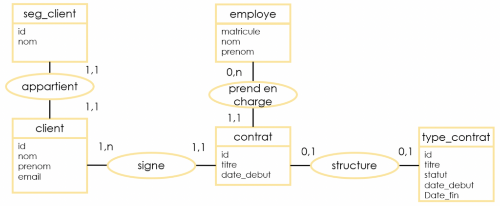

# MCD (Modèle Conceptuel Données)

---

## Exemple de MCD

Le MCD est une représentation système/données indépendamment des contraintes techniques qui permet facilement et simplement de comprendre comment les différents éléments sont liés entre eux.

Faisant partie de la boîte à outil Merise, le MCD décrit les données utilisées par le système d'information et leurs relations. Les informations sont représentées logiquement en utilisant un ensemble de règles et de diagrammes codifiés :

- Les **entités** (1 rectangle = 1 objet)
- Les **propriétés** (la liste des données de l'entité)
- Les associations qui expliquent et précisent comment les entités sont reliées entre elles (les ovales avec leurs "pattes" qui se rattachent aux entités)
- Les **cardinalité** (les petits chiffres au dessus des "pattes")

**Cardinalités** :

| Notation | Signification                                   |
| -------- | ----------------------------------------------- |
| (0,1)    | Zéro ou un (relation optionnelle)               |
| (1,1)    | Exactement un (relation obligatoire)            |
| (0,n)    | Zéro ou plusieurs (optionnelle multiple)        |
| (1,n)    | Un ou plusieurs (relation obligatoire multiple) |
| (n,m)    | Plusieurs à plusieurs (relation multiple)       |

Le MCD est utilisé assez tôt en conception de base de données, le **MCD** sert de base de travail et sera ensuite utilisé par les autres outils de **Merise**, à savoir le **MLD** et le **MPD**. Le **MCD** constitue une étape très importante de la modélisation. Si cette tâche est mal réalisée, des erreurs en cascade se produiront et rejaillairont sur le **MLD**, le **MPD** et sur la base de données finale.
